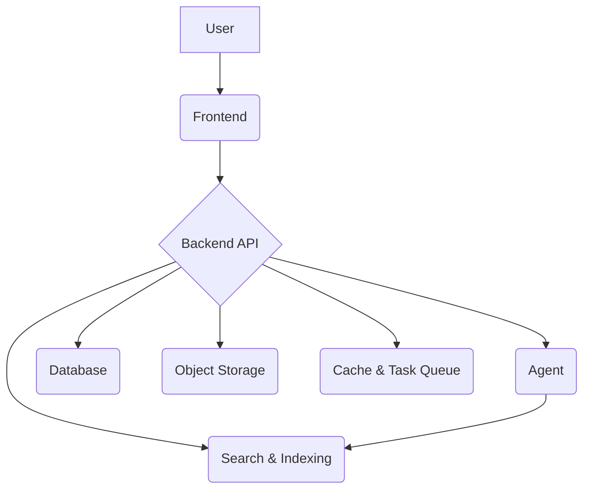

# RAGFlow Technical Deep Dive

This document provides a deep dive into the technical aspects of the RAGFlow project. It is intended for developers who want to understand the inner workings of the system and contribute to its development.

## Document Processing Pipeline

The document processing pipeline is the core of the RAGFlow system. It is responsible for parsing documents, creating chunks, and embedding them for retrieval. The pipeline is designed to be flexible and extensible, with support for a wide range of document types and chunking strategies.

### Parsing and Chunking

The document parsing and chunking logic is located in the `deepdoc` module. This module contains a set of parsers for different document types, including PDF, Word, and HTML. Each parser is responsible for extracting text and structural information from the document and creating a set of chunks.

The chunking strategy is a key aspect of the RAGFlow system. The `_concat_downward` method in `deepdoc/parser/pdf_parser.py` uses a machine learning model to decide whether to concatenate adjacent text boxes. This is a sophisticated approach that goes beyond simple rule-based chunking. The system also implements a hierarchical chunking strategy, where larger text blocks are created from smaller ones. This allows for a more flexible and efficient retrieval process.

### Embedding

The document chunks are embedded using a variety of embedding models, which are managed by the `llm_app.py` file in the `api/apps` directory. The system supports a wide range of embedding models, including both open-source and commercial models. The embedding process is initiated by the `run` endpoint in the `document_app.py` file, which adds a task to the task queue. The task is then picked up by a worker process, which calls the appropriate embedding model to embed the chunks.

### Retrieval

The retrieval process is handled by the `Retrieval` component in the `agent/component` directory. This component takes a query and retrieves the most relevant chunks from the knowledge base. The retrieval process is based on a combination of semantic search and keyword search. The `Retrieval` component also supports reranking, which can be used to improve the relevance of the retrieved chunks.

## Frontend-Backend Interaction

The frontend and backend of the RAGFlow system communicate via a REST API. The frontend is a React application that uses the `fetch` API to make HTTP requests to the backend. The backend is a Python application that uses the Flask framework to handle the API requests.

### API Communication

The API endpoints are defined in the `api/apps` directory. Each `_app.py` file corresponds to a specific set of API endpoints. For example, the `document_app.py` file defines the API endpoints for managing documents. The frontend uses the `services` directory to encapsulate the API calls, making it easy to manage data fetching and state management.

### Configuration Synchronization

The frontend UI elements are synchronized with the backend configuration via the API. When the user changes a setting in the UI, the frontend makes an API call to the backend to update the configuration. The backend then saves the new configuration to the database. When the UI is loaded, it makes an API call to the backend to get the current configuration and updates the UI accordingly. This is a standard and effective way to manage configuration in a web application.

## Visualization and Web Services

The RAGFlow system includes a rich set of visualization tools and web services.

### Visualization

The frontend is responsible for all the visualization, with the knowledge graph being a key feature. The knowledge graph is a powerful tool for exploring the relationships between different documents and concepts in the knowledge base. The backend provides the data for the visualization via the API.

### Web Services

The backend web services are located in the `api` directory. Each `_app.py` file corresponds to a specific set of services. For example, the `document_app.py` file provides the services for managing documents, while the `llm_app.py` file provides the services for managing LLMs.

# Introduction

## What is RAGFlow?

RAGFlow is an open-source, enterprise-grade Retrieval-Augmented Generation (RAG) platform. It provides a comprehensive suite of tools and services for building, managing, and deploying RAG applications. RAGFlow is designed to be flexible, extensible, and easy to use, with a focus on providing a seamless experience for both end-users and developers.

## Key Features

*   **Component-Based Agent:** RAGFlow's agent is built on a component-based architecture, which allows for a high degree of customization and extensibility.
*   **Flexible Data Source Support:** RAGFlow supports a wide range of data sources, including PDF, Word, and HTML documents, as well as web pages and other unstructured data.
*   **Multi-Tenant Architecture:** RAGFlow is designed with a multi-tenant architecture, which allows for the secure and efficient management of multiple tenants and their data.
*   **Sophisticated Chunking:** RAGFlow uses a sophisticated chunking strategy that goes beyond simple rule-based chunking.
*   **Rich Visualization Tools:** RAGFlow includes a rich set of visualization tools, including a knowledge graph, which can be used to explore the relationships between different documents and concepts in the knowledge base.

## System Architecture

RAGFlow is a multi-component system that is designed to be deployed using Docker Compose. The system consists of the following services:

*   **ragflow:** The main application service, which includes the backend API and the agent.
*   **mysql:** The database service, which is used to store all the application data.
*   **minio:** The object storage service, which is used to store the documents and other files.
*   **elasticsearch/opensearch/infinity:** The search and indexing service, which is used to index the document chunks for retrieval.
*   **redis:** The caching and task queuing service.

The following diagram illustrates the system architecture:



### File Structure

The following diagram illustrates the main file structure of the RAGFlow project:

```
RAGFLOW/
├── api/             # Backend API (Flask)
│   ├── apps/        # API endpoints for different modules
│   ├── db/          # Database models and services
│   └── utils/       # Utility functions
├── agent/           # RAG agent and components
│   ├── component/   # Reusable components for building RAG workflows
│   └── templates/   # Pre-built agent templates
├── deepdoc/         # Document parsing and chunking
│   └── parser/      # Parsers for different document types
├── docker/          # Docker configurations
├── rag/             # Core RAG logic
├── web/             # Frontend application (React)
│   ├── src/
│   │   ├── components/ # Reusable React components
│   │   ├── pages/      # Main pages of the application
│   │   └── services/   # API service calls
│   └── public/
└── ...
```

# Getting Started

## Prerequisites

Before you can install and run RAGFlow, you need to make sure you have the following software installed on your system:

*   Docker
*   Docker Compose

## Installation

To install and run RAGFlow, follow these steps:

1.  Clone the RAGFlow repository from GitHub:

    ```
    git clone https://github.com/infiniflow/ragflow.git
    ```

2.  Navigate to the `docker` directory:

    ```
    cd ragflow/docker
    ```

3.  Start the RAGFlow services using Docker Compose:

    ```
    docker-compose up -d
    ```

This will start all the necessary services, including the backend API, the database, and the object storage.

## Configuration

The RAGFlow system is configured using a set of environment variables, which are defined in the `.env` file in the `docker` directory. You can customize the configuration by editing this file.

The main configuration file for the backend services is `service_conf.yaml.template`. This file is populated with the environment variables from the `.env` file when the Docker container starts. You can customize the service configuration by editing this file.

# Core Concepts

## Tenants

RAGFlow is a multi-tenant system, which means that it can be used to serve multiple tenants from a single installation. Each tenant has its own set of knowledge bases, documents, and LLMs. This allows for the secure and efficient management of multiple tenants and their data.

## Knowledge Bases

A knowledge base is a collection of documents that can be used to answer questions. Each knowledge base has its own set of documents, as well as its own configuration for parsing, chunking, and embedding.

## Documents

A document is a single file that can be added to a knowledge base. RAGFlow supports a wide range of document types, including PDF, Word, and HTML. When a document is added to a knowledge base, it is parsed, chunked, and embedded for retrieval.

## LLMs

RAGFlow supports a wide range of LLMs, including both open-source and commercial models. Each tenant can configure their own set of LLMs, which can be used for a variety of tasks, such as embedding, reranking, and generating answers.

## Agents & Canvas

The RAGFlow agent is a powerful tool for building custom RAG workflows. The agent is built on a component-based architecture, which allows for a high degree of customization and extensibility. The canvas is a graphical user interface that can be used to build and manage RAG workflows.

# API Reference

This section provides a comprehensive reference for the backend API. It includes all the available endpoints, their parameters, and their responses.

# Frontend

The RAGFlow frontend is a modern web application built with React and TypeScript. It provides a rich and interactive user experience for managing knowledge bases, documents, and agents.

## Architecture

The frontend is a single-page application (SPA) that is built using the following technologies:

*   **React:** A JavaScript library for building user interfaces.
*   **TypeScript:** A typed superset of JavaScript that compiles to plain JavaScript.
*   **Ant Design:** A React UI library that provides a set of high-quality components.
*   **Tailwind CSS:** A utility-first CSS framework for rapidly building custom user interfaces.
*   **React Query:** A data-fetching library for React that provides a powerful and flexible way to manage server state.

## Components and Pages

The frontend is organized into a set of components and pages. The `components` directory contains a set of reusable components that are used throughout the application. The `pages` directory contains the main pages of the application, such as the chat interface, the knowledge base management page, and the agent canvas.

## Customization

The frontend is designed to be customizable. You can customize the UI by editing the CSS files in the `src/less` directory. You can also build new features by creating new components and pages.

# Development

This section provides a guide for developers who want to contribute to the RAGFlow project.

## Local Development Environment

To set up a local development environment, you need to have the following software installed on your system:

*   Python 3.10+
*   Node.js 16+
*   Docker
*   Docker Compose

To set up the development environment, follow these steps:

1.  Clone the RAGFlow repository from GitHub:

    ```
    git clone https://github.com/infiniflow/ragflow.git
    ```

2.  Install the Python dependencies:

    ```
    cd ragflow
    pip install -r requirements.txt
    ```

3.  Install the frontend dependencies:

    ```
    cd web
    npm install
    ```

4.  Start the dependent services using Docker Compose:

    ```
    cd ../docker
    docker-compose -f docker-compose-base.yml up -d
    ```

5.  Start the backend server:

    ```
    cd ..
    python api/ragflow_server.py
    ```

6.  Start the frontend server:

    ```
    cd web
    npm run dev
    ```

## Creating New Components

To create a new component for the agent, you need to create a new Python file in the `agent/component` directory. The file should contain a class that inherits from the `ComponentBase` class. The class should also define a `run` method that implements the component's logic.

## Submitting a Pull Request

To submit a pull request, follow these steps:

1.  Fork the RAGFlow repository on GitHub.
2.  Create a new branch for your changes.
3.  Make your changes and commit them to your branch.
4.  Push your branch to your forked repository.
5.  Create a new pull request from your forked repository to the main RAGFlow repository.
